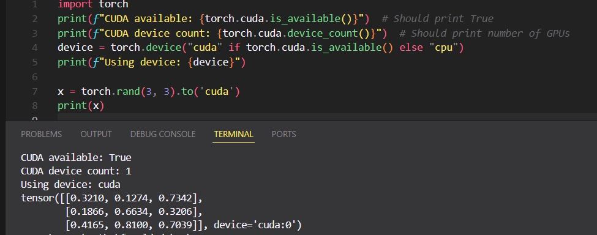

# How to set up CUDA for Pytorch in Windows environment properly (March 2025)

I know that a lot of people had/has problem to set up CUDA for application in VS Code and I found out after a bit research and sutff that this isnt that dificult, you just have to be patient. I gathered the info needed to set this up in this repo. Hope you can have this running asap!

> [!NOTE]
> You must have an NVIDIA GPU
> 
---

So basically the problem is related with versions. To check, you can open the cmd prompt and type, 

`$ nvcc --version`

to check the version of you CUDA and,

`$ pip show torch`

to check the torch version. 
So, the latest version I could find that we can run pytorch is 2.5.1. There is 2.6 but it didnt worked for me. According to [Pytorch website](https://pytorch.org/get-started/previous-versions/) , pytorch version2.5.1 has the following CUDA versions: 11.8, 12.1 and 12.4. I decided to use 12.4 but I believe any could work.

---

First, remove the CUDA version you have now by going to Control Panel → Programs → Programs and Features, right click and unnistall NVIDIA CUDA Toolkit 12.8 (or whatever version you have).

To get any CUDA version running, you want to install from [the oficial website](https://developer.nvidia.com/cuda-toolkit-archive) (I did the 12.4.0).

> [!TIP]
> I recommend in installation using custom installation and removing the drivers update check box if your CUDA version was newer then the one you are installing right now.

Once it's done, restart your computer.

---

Then, open VS Code and go to the terminal. You basically need to uninstall you currrently torch version and update the newest one:

`$ pip uninstall torch torchvision torchaudio`

`$ pip install torch==2.5.1+cu124 torchvision==0.20.1+cu124 torchaudio==2.5.1 --extra-index-url https://download.pytorch.org/whl/cu124`

> [!WARNING]
> [check](https://pytorch.org/get-started/previous-versions/) this last command. It should be different depending on the version you're going for. The one above is specifically for Pytorch v2.5.1.

Then check version again just to make sure, and it should be done :+1:
